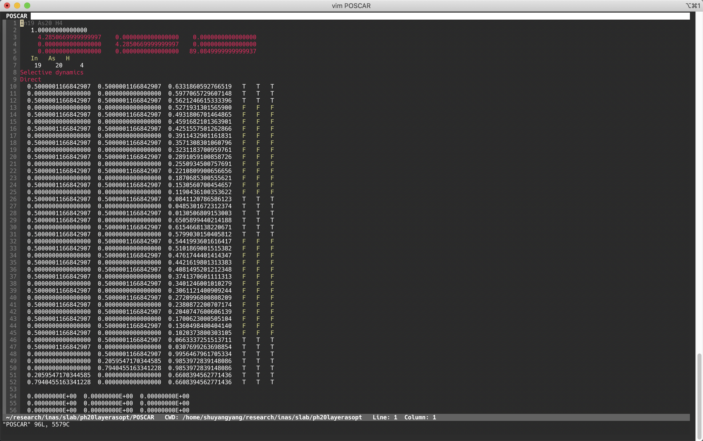
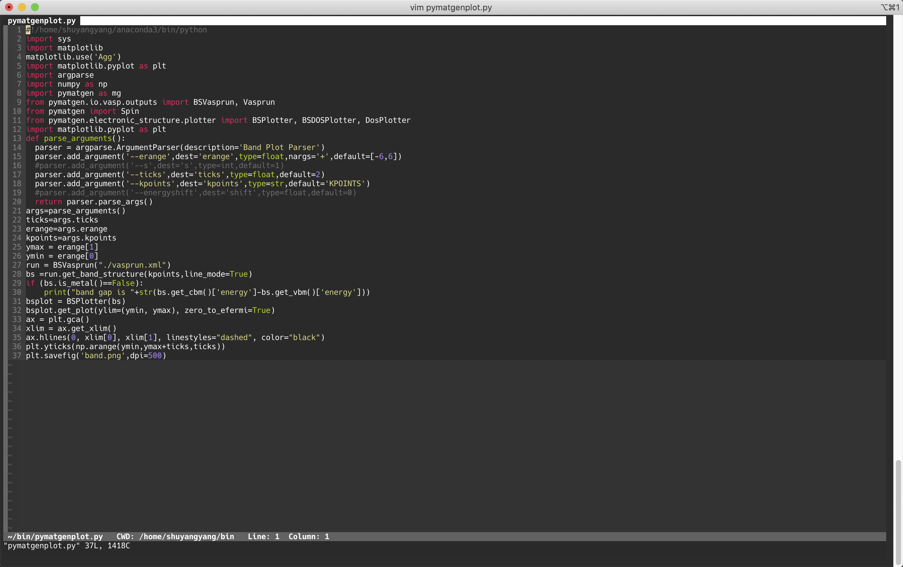

vim-setting

This is my vim setting for python and VASP input files. A beautiful colorscheme could profoundly improve your working proficiency! Enjoy it!

#Install
```bash
cp .vim ~
cp .vimrc ~
```

#Screenshots

Highlighs in POSCAR


Highlights in INCAR


Monokai colorscheme in python
