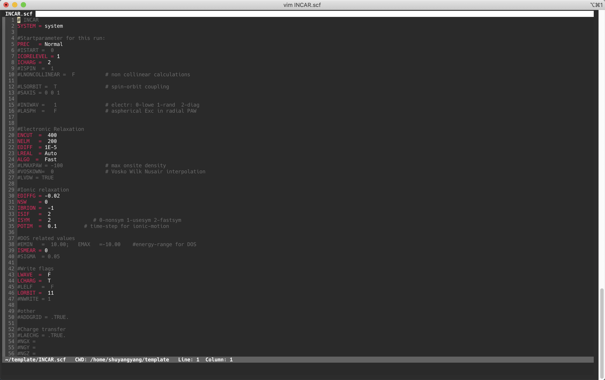

# vim-setting

This is my vim setting for python and VASP inputs syntax. A beautiful color scheme could profoundly improve your working proficiency! Enjoy it!

## Install
```bash
cp .vim ~
cp .vimrc ~
```

## Screenshots

Highlights in POSCAR


Highlights in INCAR


Monokai colorscheme in python

